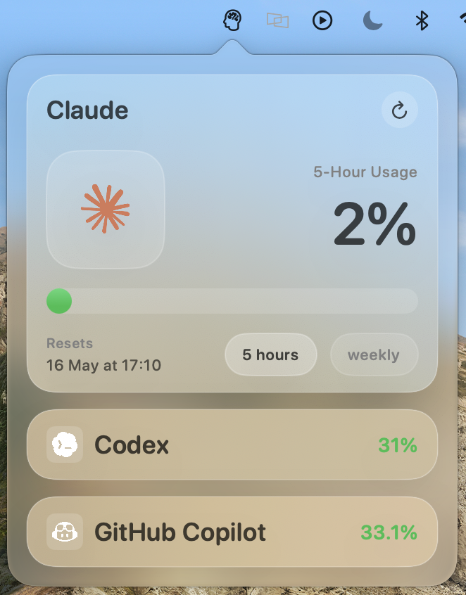
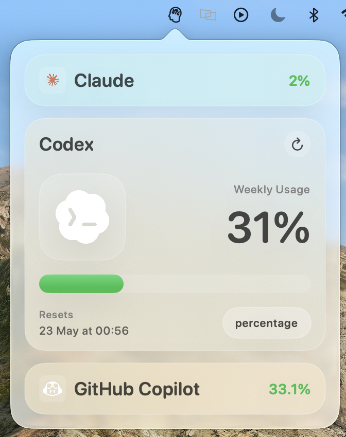
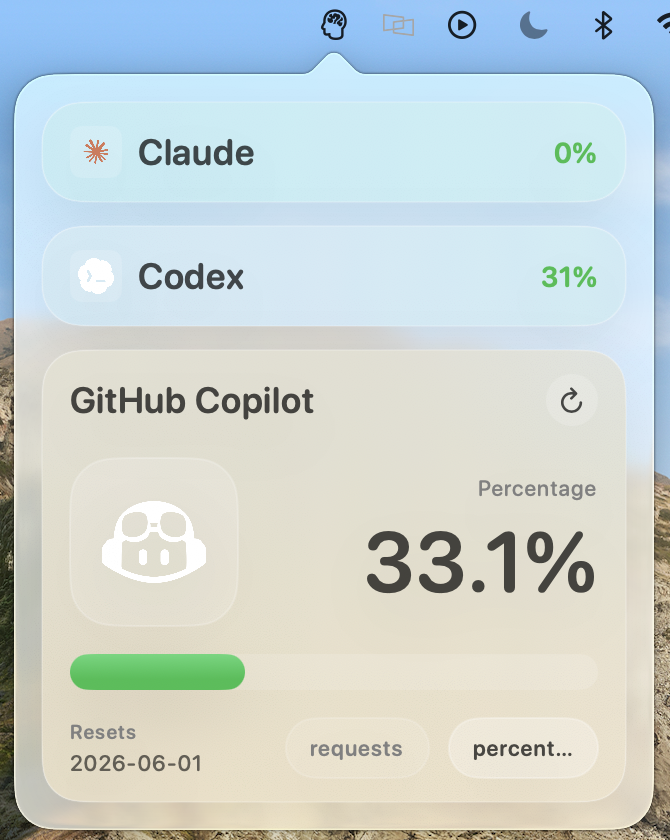

# AI Consumption Widget

macOS menu bar widget to monitor AI quota usage across multiple providers from local authenticated sessions.

## Demo

<p align="center">
  
  
  
</p>

## Implemented Features

- Menu bar app (`LSUIElement`) with popover dashboard
- Multi-provider support:
  - Claude (Anthropic OAuth usage)
  - Codex (ChatGPT usage endpoint)
  - GitHub Copilot (premium quota usage)
- Provider token auto-discovery:
  - Claude from macOS Keychain (`Claude Code-credentials`)
  - Copilot from macOS Keychain (`copilot-cli`)
  - Codex from `~/.codex/auth.json`
- Claude rate-limit recovery workflow:
  - On `429` from `/api/oauth/usage`, refreshes OAuth token via `https://console.anthropic.com/v1/oauth/token`
  - Persists rotated `accessToken` and `refreshToken` back to Keychain
  - Retries usage request with fresh token
- Copilot metrics aligned to consumed usage:
  - Converts `percent_remaining` into consumed percentage (`100 - remaining`)
  - `requests` and `percentage` toggles in the card
- Dynamic card UI with provider logos (`claude-logo`, `copilot-logo`, `codex-logo`)
- Dynamic popover height based on visible content (collapsed/expanded cards)
- Manual refresh plus automatic refresh every 5 minutes

## Requirements

- macOS 14+
- Xcode 15+
- [XcodeGen](https://github.com/yonaskolb/XcodeGen)
- Local authenticated sessions for providers you want to display

## Installation

Releases page:

- https://github.com/fabioaltea/ai-consumption-widget/releases

### Fast Install (No Build)

1. Open the releases page above
2. Download `AIConsumptionWidget-macOS.zip`
3. Extract `AIConsumptionWidget.app`
4. Double click the app to launch

If macOS blocks first launch, right click the app and choose `Open`.

Optional: move the app to `/Applications`.

The repository includes CI packaging via [release-macos.yml](.github/workflows/release-macos.yml):

- Manual trigger: `Actions` -> `Build macOS Package` -> `Run workflow`
- Tag trigger: push tags like `v1.0.0` to auto-attach zip to the GitHub Release

Build from source (optional):

1. Generate project files:

```bash
xcodegen generate
```

2. Build debug app:

```bash
xcodebuild -project AIConsumptionWidget.xcodeproj -scheme AIConsumptionWidget -configuration Debug build
```

3. Launch:

```bash
open ~/Library/Developer/Xcode/DerivedData/AIConsumptionWidget-*/Build/Products/Debug/AIConsumptionWidget.app
```

## Package In Repository

Packaging script included in the repository:

- [scripts/package_release.sh](scripts/package_release.sh)

It builds a Release app and creates a zip package in `dist/`.

Run:

```bash
./scripts/package_release.sh
```

Output example:

- `dist/AIConsumptionWidget-macOS.zip`

## Authentication Notes

### Claude

- Reads `claudeAiOauth.accessToken` and `claudeAiOauth.refreshToken` from Keychain service `Claude Code-credentials`
- Refresh token rotation is handled automatically when the usage endpoint rate-limits the current access token

### Copilot

- Reads token from Keychain service `copilot-cli`

### Codex

- Reads token from `~/.codex/auth.json` (`tokens.access_token`)

## Project Structure

```text
Sources/
  Models/
  Services/
  Stores/
  Views/
Resources/
scripts/
project.yml
```

## Troubleshooting

### Provider card not visible

- Verify provider token exists in the expected source
- Check app logs for auth/decoding errors
- Refresh app after logging in with the provider CLI/tool

### Claude usage fails repeatedly

- Confirm local Claude session is still valid
- If refresh token is expired/revoked, log in again with Claude Code

### Build issues after project config changes

- Regenerate project: `xcodegen generate`

## Development

To modify target/build phases, update `project.yml` first, then regenerate with `xcodegen generate`.
